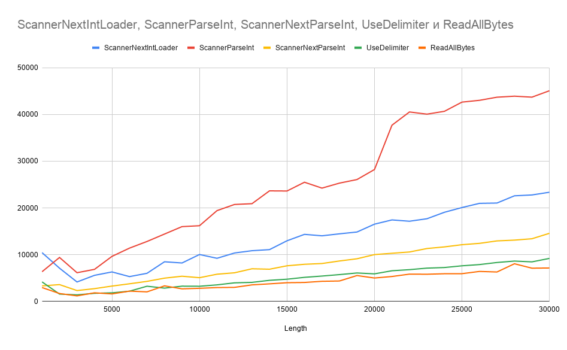

# LoadingCompare

#### Base goal
Aim is to find fastest method to load some int numbers from text file to int array.

#### Assigment description

Suppose we have text file "input.txt". 

    5
    -1 150 0 -500 6

###### File format
* **First line:** not negative N.
* **Second line:** N int numbers separated by space.

All we need to do is to read **N** numbers from this file to int array. 
For the example above it will seems like 

    int[] {-1, 150, 0, -500, 6}
    
#### Methods to compare

* [ScannerNextIntLoader](src/ScannerNextIntLoader.java)
* [ScannerParseInt](src/ScannerParseInt.java)
* [ScannerNextParseInt](src/ScannerNextParseInt.java)
* [UseDelimiter](src/UseDelimiter.java)
* [ReadAllBytes](src/ReadAllBytes.java)

#### Resulting diagram


#### Resulting table

Length | ScannerNextIntLoader | ScannerParseInt | ScannerNextParseInt | UseDelimiter | ReadAllBytes
-------|----------------------|-----------------|---------------------|--------------|-------------
1000|10447|6354|3325|4184|2972
2000|7115|9410|3599|1569|1693
3000|4161|6145|2324|1406|1187
4000|5585|6863|2737|1738|1845
5000|6313|9646|3287|1839|1607
6000|5311|11409|3775|2191|2207
7000|6019|12831|4293|3253|2048
8000|8487|14420|4983|2846|3333
9000|8226|16008|5394|3267|2693
10000|10042|16201|5078|3247|2809
11000|9232|19432|5825|3544|2964
12000|10366|20749|6128|3978|3010
13000|10855|20919|6988|4079|3542
14000|11086|23664|6893|4515|3761
15000|12978|23631|7626|4755|4006
16000|14353|25507|7949|5154|4059
17000|14042|24250|8113|5431|4306
18000|14469|25319|8656|5741|4374
19000|14854|26083|9128|6089|5539
20000|16535|28229|10022|5902|5010
21000|17443|37716|10307|6564|5335
22000|17163|40546|10581|6799|5842
23000|17696|40079|11322|7127|5818
24000|19082|40690|11671|7254|5927
25000|20092|42654|12139|7622|5937
26000|20987|43039|12427|7886|6419
27000|21057|43706|12952|8331|6298
28000|22602|43926|13121|8637|8062
29000|22787|43716|13413|8466|7113
30000|23366|45091|14580|9208|7157

#### Fastest loading method 

##### [ReadAllBytes](src/ReadAllBytes.java)

```java
    public int[] load() throws IOException {
        String[] input = new String(Files.readAllBytes(Paths.get(fileName))).split("\\s+");

        int n = Integer.parseInt(input[0]);
        int[] numbers = getIntArray(input, 1, 1 + n);
        return numbers;
    }

    private static int[] getIntArray(String[] in, int from, int to) {
        int[] a = new int[to - from];

        for (int i = 0; i < a.length; i++) {
            a[i] = Integer.parseInt(in[from + i]);
        }
        return a;
    }
```
